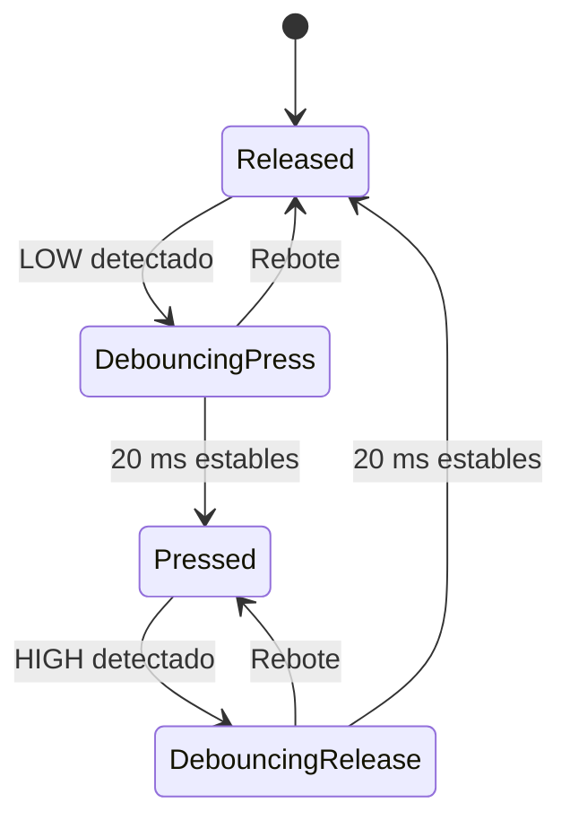

## Máquina de estados del botón

```mermaid
stateDiagram-v2
    [*] --> Released

    Released --> DebouncingPress : LOW detectado
    DebouncingPress --> Released : Rebote
    DebouncingPress --> Pressed : 20 ms estables

    Pressed --> DebouncingRelease : HIGH detectado
    DebouncingRelease --> Pressed : Rebote
    DebouncingRelease --> Released : 20 ms estables
```